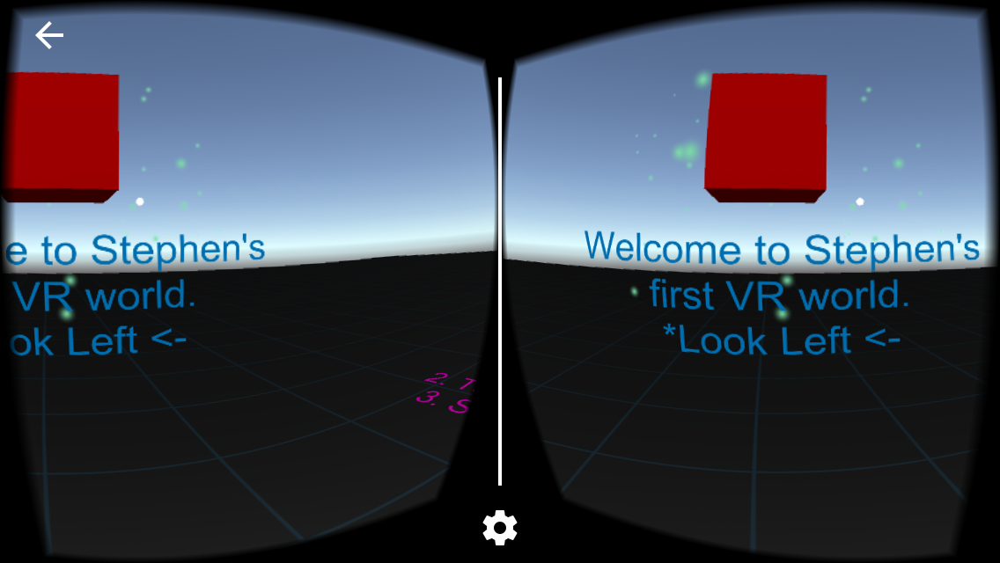

## Project Name
Hello World in VR!

## Description
This is my first VR app. The world is from the Google VR Demo. I am using the demo scene as my base and customizing it. It's a fun little app that will be deployable on iOS and Android.

## Technologies
Unity, C#, Android Studio and Xcode (Used for deployment).
Note: Google VR SDK was not used in this project.

## Current Features
* User will be met with a hello and instructions.
* User will be able to look around.
* User will have buttons they can push to initiate actions.

## Future Features

## Usage
* Click "Download" on
[https://github.com/Mehequanna/UnityVR-HelloWorld](https://github.com/Mehequanna/UnityVR-HelloWorld)
* Open Unity and choose open project (You will need to know the repo location)
* Further Instructions to come.

## Known Issues
* This project will need to be opened in Unity 5.5.1

## Author
Stephen Emery

## License
This work can be used under the MIT License.
Copyright (c) 2017 Stephen Emery
